# WheelShift Pro - Database Design Diagram (Updated with File Storage)

## Complete Database Schema with Motorcycle Support and File Storage Integration

```mermaid
erDiagram
    %% Core Entities - Cars
    CAR_MODELS {
        BIGINT id PK
        VARCHAR make
        VARCHAR model
        VARCHAR variant
        INT year
        VARCHAR body_type
        VARCHAR fuel_type
        VARCHAR transmission_type
        INT seating_capacity
        VARCHAR model_image_id "File ID for model image"
        BOOLEAN is_active
        TIMESTAMP created_at
        TIMESTAMP updated_at
    }

    CARS {
        BIGINT id PK
        VARCHAR vin_number UK
        VARCHAR registration_number UK
        BIGINT car_model_id FK
        VARCHAR color
        INT mileage_km
        INT manufacture_year
        DATE registration_date
        VARCHAR status
        BIGINT storage_location_id FK
        DECIMAL purchase_price
        DATE purchase_date
        DECIMAL selling_price
        DECIMAL minimum_price
        INT previous_owners
        DATE insurance_expiry_date
        BOOLEAN is_financed
        TEXT description
        VARCHAR primary_image_id "Primary car image"
        TEXT gallery_image_ids "Gallery images (comma-separated)"
        TEXT document_file_ids "Documents (comma-separated)"
        TIMESTAMP created_at
        TIMESTAMP updated_at
    }

    CAR_DETAILED_SPECS {
        BIGINT id PK
        BIGINT car_id FK
        VARCHAR engine_type
        INT engine_capacity_cc
        DECIMAL max_power_bhp
        DECIMAL max_torque_nm
        INT length_mm
        INT width_mm
        INT height_mm
        BOOLEAN has_abs
        BOOLEAN has_airbags
        TEXT features
        TIMESTAMP created_at
        TIMESTAMP updated_at
    }

    %% Core Entities - Motorcycles
    MOTORCYCLE_MODELS {
        BIGINT id PK
        VARCHAR make
        VARCHAR model
        VARCHAR variant
        INT year
        INT engine_capacity
        VARCHAR fuel_type
        VARCHAR transmission_type
        VARCHAR vehicle_type
        INT seating_capacity
        VARCHAR model_image_id "File ID for model image"
        BOOLEAN is_active
        TIMESTAMP created_at
        TIMESTAMP updated_at
    }

    MOTORCYCLES {
        BIGINT id PK
        VARCHAR vin_number UK
        VARCHAR registration_number UK
        VARCHAR engine_number
        VARCHAR chassis_number
        BIGINT motorcycle_model_id FK
        VARCHAR color
        INT mileage_km
        INT manufacture_year
        DATE registration_date
        VARCHAR status
        BIGINT storage_location_id FK
        DECIMAL purchase_price
        DATE purchase_date
        DECIMAL selling_price
        DECIMAL minimum_price
        INT previous_owners
        DATE insurance_expiry_date
        DATE pollution_certificate_expiry
        BOOLEAN is_financed
        BOOLEAN is_accidental
        TEXT description
        VARCHAR primary_image_id "Primary motorcycle image"
        TEXT gallery_image_ids "Gallery images (comma-separated)"
        TEXT document_file_ids "Documents (comma-separated)"
        TIMESTAMP created_at
        TIMESTAMP updated_at
    }

    MOTORCYCLE_DETAILED_SPECS {
        BIGINT id PK
        BIGINT motorcycle_id FK
        VARCHAR engine_type
        DECIMAL max_power_bhp
        DECIMAL max_torque_nm
        VARCHAR cooling_system
        DECIMAL fuel_tank_capacity
        DECIMAL claimed_mileage_kmpl
        INT length_mm
        INT width_mm
        INT height_mm
        INT wheelbase_mm
        INT ground_clearance_mm
        INT kerb_weight_kg
        VARCHAR front_brake_type
        VARCHAR rear_brake_type
        BOOLEAN abs_available
        VARCHAR front_suspension
        VARCHAR rear_suspension
        VARCHAR front_tyre_size
        VARCHAR rear_tyre_size
        BOOLEAN has_electric_start
        BOOLEAN has_kick_start
        BOOLEAN has_digital_console
        BOOLEAN has_usb_charging
        BOOLEAN has_led_lights
        TEXT additional_features
        TIMESTAMP created_at
        TIMESTAMP updated_at
    }

    MOTORCYCLE_INSPECTIONS {
        BIGINT id PK
        BIGINT motorcycle_id FK
        DATE inspection_date
        BIGINT inspector_id FK
        VARCHAR overall_condition
        VARCHAR engine_condition
        VARCHAR transmission_condition
        VARCHAR suspension_condition
        VARCHAR brake_condition
        VARCHAR tyre_condition
        VARCHAR electrical_condition
        VARCHAR body_condition
        BOOLEAN has_accident_history
        BOOLEAN requires_repair
        DECIMAL estimated_repair_cost
        TEXT repair_notes
        TEXT inspection_image_ids "Inspection photos (comma-separated)"
        VARCHAR inspection_report_file_id "Inspection report PDF"
        BOOLEAN passed
        TEXT notes
        TIMESTAMP created_at
        TIMESTAMP updated_at
    }

    CAR_INSPECTIONS {
        BIGINT id PK
        BIGINT car_id FK
        DATE inspection_date
        BIGINT inspector_id FK
        VARCHAR overall_condition
        BOOLEAN has_accident_history
        BOOLEAN requires_repair
        DECIMAL estimated_repair_cost
        TEXT repair_notes
        TEXT inspection_image_ids "Inspection photos (comma-separated)"
        VARCHAR inspection_report_file_id "Inspection report PDF"
        BOOLEAN passed
        TEXT notes
        TIMESTAMP created_at
        TIMESTAMP updated_at
    }

    CAR_MOVEMENTS {
        BIGINT id PK
        BIGINT car_id FK
        BIGINT from_location_id FK
        BIGINT to_location_id FK
        DATETIME moved_at
        BIGINT moved_by_employee_id FK
    }

    MOTORCYCLE_MOVEMENTS {
        BIGINT id PK
        BIGINT motorcycle_id FK
        BIGINT from_location_id FK
        BIGINT to_location_id FK
        DATETIME moved_at
        BIGINT moved_by_employee_id FK
        TEXT notes
    }

    %% Storage & Location
    STORAGE_LOCATIONS {
        BIGINT id PK
        VARCHAR name
        VARCHAR address
        VARCHAR city
        VARCHAR state
        VARCHAR postal_code
        VARCHAR contact_person
        VARCHAR contact_phone
        INT total_capacity
        INT current_vehicle_count
        VARCHAR location_image_id "Location photo"
        BOOLEAN is_active
        TIMESTAMP created_at
        TIMESTAMP updated_at
    }

    %% Clients & Employees
    CLIENTS {
        BIGINT id PK
        VARCHAR name
        VARCHAR email UK
        VARCHAR phone
        VARCHAR address
        VARCHAR city
        VARCHAR state
        VARCHAR postal_code
        VARCHAR status
        INT purchase_count
        DATE last_purchase_date
        VARCHAR profile_image_id "Client profile photo"
        TEXT document_file_ids "Client documents (comma-separated)"
        TIMESTAMP created_at
        TIMESTAMP updated_at
    }

    EMPLOYEES {
        BIGINT id PK
        VARCHAR name
        VARCHAR email UK
        VARCHAR password
        VARCHAR phone
        VARCHAR department
        VARCHAR position
        VARCHAR status
        DATETIME last_login
        INT sales_handled
        VARCHAR profile_image_id "Employee profile photo"
        TIMESTAMP created_at
        TIMESTAMP updated_at
    }

    %% Transactions - Inquiries
    INQUIRIES {
        BIGINT id PK
        BIGINT car_id FK
        BIGINT motorcycle_id FK
        VARCHAR vehicle_type
        BIGINT client_id FK
        BIGINT assigned_employee_id FK
        VARCHAR inquiry_type
        TEXT message
        VARCHAR status
        TEXT response
        DATETIME response_date
        TEXT attachment_file_ids "Inquiry attachments (comma-separated)"
        TIMESTAMP created_at
        TIMESTAMP updated_at
    }

    %% Transactions - Reservations
    RESERVATIONS {
        BIGINT id PK
        BIGINT car_id FK
        BIGINT motorcycle_id FK
        VARCHAR vehicle_type
        BIGINT client_id FK
        DATETIME reservation_date
        DATETIME expiry_date
        VARCHAR status
        DECIMAL deposit_amount
        BOOLEAN deposit_paid
        TEXT notes
        TEXT reservation_document_ids "Reservation docs (comma-separated)"
        TIMESTAMP created_at
        TIMESTAMP updated_at
    }

    %% Transactions - Sales
    SALES {
        BIGINT id PK
        BIGINT car_id FK
        BIGINT motorcycle_id FK
        VARCHAR vehicle_type
        BIGINT client_id FK
        BIGINT employee_id FK
        DATETIME sale_date
        DECIMAL sale_price
        DECIMAL commission_rate
        DECIMAL total_commission
        VARCHAR payment_method
        TEXT sale_document_ids "Sale documents (comma-separated)"
        TIMESTAMP created_at
        TIMESTAMP updated_at
    }

    %% Financial Transactions
    FINANCIAL_TRANSACTIONS {
        BIGINT id PK
        BIGINT car_id FK
        BIGINT motorcycle_id FK
        VARCHAR vehicle_type
        VARCHAR transaction_type
        DECIMAL amount
        DATETIME transaction_date
        TEXT description
        VARCHAR vendor_name
        TEXT transaction_file_ids "Transaction files (comma-separated)"
        TIMESTAMP created_at
        TIMESTAMP updated_at
    }

    %% Events & Tasks
    EVENTS {
        BIGINT id PK
        VARCHAR type
        VARCHAR name
        BIGINT car_id FK
        BIGINT motorcycle_id FK
        VARCHAR vehicle_type
        VARCHAR title
        DATETIME start_time
        DATETIME end_time
        TEXT attachment_file_ids "Event attachments (comma-separated)"
        TIMESTAMP created_at
        TIMESTAMP updated_at
    }

    TASKS {
        BIGINT id PK
        VARCHAR title
        TEXT description
        VARCHAR status
        VARCHAR priority
        BIGINT assigned_employee_id FK
        DATE due_date
        VARCHAR tags
        TEXT attachment_file_ids "Task attachments (comma-separated)"
        TIMESTAMP created_at
        TIMESTAMP updated_at
    }

    %% File Storage System
    FILE_METADATA {
        BIGINT id PK
        VARCHAR file_id UK "UUID identifier"
        VARCHAR original_filename
        VARCHAR stored_filename
        VARCHAR file_type "IMAGE, PDF, EXCEL, CSV, DOCUMENT, OTHER"
        VARCHAR mime_type
        BIGINT file_size
        VARCHAR file_extension
        VARCHAR storage_path
        VARCHAR public_url
        VARCHAR upload_source
        VARCHAR uploaded_by
        VARCHAR status "ACTIVE, DELETED, ARCHIVED"
        TEXT metadata_json
        TIMESTAMP created_at
        TIMESTAMP updated_at
    }

    %% RBAC System
    ROLES {
        BIGINT id PK
        VARCHAR name UK
        VARCHAR description
        INT hierarchy_level
        TIMESTAMP created_at
        TIMESTAMP updated_at
    }

    PERMISSIONS {
        BIGINT id PK
        VARCHAR name UK
        VARCHAR resource
        VARCHAR action
        VARCHAR description
        TIMESTAMP created_at
        TIMESTAMP updated_at
    }

    ROLE_PERMISSIONS {
        BIGINT id PK
        BIGINT role_id FK
        BIGINT permission_id FK
        TIMESTAMP created_at
        TIMESTAMP updated_at
    }

    EMPLOYEE_ROLES {
        BIGINT id PK
        BIGINT employee_id FK
        BIGINT role_id FK
        TIMESTAMP assigned_at
        TIMESTAMP created_at
        TIMESTAMP updated_at
    }

    %% Relationships - Cars
    CARS ||--o{ CAR_DETAILED_SPECS : "has specs"
    CARS }o--|| CAR_MODELS : "is model"
    CARS }o--o| STORAGE_LOCATIONS : "stored at"
    CARS ||--o{ CAR_INSPECTIONS : "inspected"

    %% Relationships - Motorcycles
    MOTORCYCLES ||--o{ MOTORCYCLE_DETAILED_SPECS : "has specs"
    MOTORCYCLES }o--|| MOTORCYCLE_MODELS : "is model"
    MOTORCYCLES }o--o| STORAGE_LOCATIONS : "stored at"
    MOTORCYCLES ||--o{ MOTORCYCLE_INSPECTIONS : "inspected"

    %% Relationships - Inquiries
    INQUIRIES }o--o| CARS : "about car"
    INQUIRIES }o--o| MOTORCYCLES : "about motorcycle"
    INQUIRIES }o--|| CLIENTS : "from"
    INQUIRIES }o--o| EMPLOYEES : "assigned to"

    %% Relationships - Reservations
    RESERVATIONS }o--o| CARS : "reserves car"
    RESERVATIONS }o--o| MOTORCYCLES : "reserves motorcycle"
    RESERVATIONS }o--|| CLIENTS : "by"

    %% Relationships - Sales
    SALES }o--o| CARS : "sells car"
    SALES }o--o| MOTORCYCLES : "sells motorcycle"
    SALES }o--|| CLIENTS : "to"
    SALES }o--|| EMPLOYEES : "by"

    %% Relationships - Financial
    FINANCIAL_TRANSACTIONS }o--o| CARS : "for car"
    FINANCIAL_TRANSACTIONS }o--o| MOTORCYCLES : "for motorcycle"

    %% Relationships - Events
    EVENTS }o--o| CARS : "related to car"
    EVENTS }o--o| MOTORCYCLES : "related to motorcycle"

    %% Relationships - Inspections
    CAR_INSPECTIONS }o--|| EMPLOYEES : "inspected by"
    MOTORCYCLE_INSPECTIONS }o--|| EMPLOYEES : "inspected by"

    %% Relationships - Movements
    CAR_MOVEMENTS }o--|| CARS : "tracks car"
    CAR_MOVEMENTS }o--o| STORAGE_LOCATIONS : "from location"
    CAR_MOVEMENTS }o--|| STORAGE_LOCATIONS : "to location"
    CAR_MOVEMENTS }o--o| EMPLOYEES : "moved by"
    
    MOTORCYCLE_MOVEMENTS }o--|| MOTORCYCLES : "tracks motorcycle"
    MOTORCYCLE_MOVEMENTS }o--o| STORAGE_LOCATIONS : "from location"
    MOTORCYCLE_MOVEMENTS }o--|| STORAGE_LOCATIONS : "to location"
    MOTORCYCLE_MOVEMENTS }o--o| EMPLOYEES : "moved by"

    %% Relationships - Tasks
    TASKS }o--o| EMPLOYEES : "assigned to"

    %% Relationships - RBAC
    ROLE_PERMISSIONS }o--|| ROLES : "has"
    ROLE_PERMISSIONS }o--|| PERMISSIONS : "grants"
    EMPLOYEE_ROLES }o--|| EMPLOYEES : "has"
    EMPLOYEE_ROLES }o--|| ROLES : "assigned"
```



## Key Design Principles

### 1. **Dual Vehicle Support**
- Separate but parallel structures for cars and motorcycles
- Shared entities (Storage, Clients, Employees) support both
- Transaction entities use polymorphic relationships via `vehicle_type` discriminator

### 2. **File Storage Integration**
- **No direct relationships** between entities and file_metadata table
- Files referenced by **UUID file IDs** stored as VARCHAR or TEXT columns
- Single files: VARCHAR(64) for file ID (e.g., `primary_image_id`, `profile_image_id`)
- Multiple files: TEXT for comma-separated file IDs (e.g., `gallery_image_ids`, `document_file_ids`)
- **Benefits:**
  - Simple implementation without junction tables
  - Easy migration from local storage to S3/cloud
  - Centralized file metadata management
  - Flexible URL generation based on storage backend

### 3. **Referential Integrity**
- Foreign key constraints ensure data consistency
- Cascade rules prevent orphaned records
- Check constraints validate business rules
- File IDs are **not** foreign keys (allows flexibility for deleted files)

### 4. **Normalization**
- Separate model catalogs (car_models, motorcycle_models)
- Detailed specs in separate tables (one-to-one relationships)
- Transaction history preserved independently
- File metadata centralized in file_metadata table

### 5. **Audit Trail**
- All tables include `created_at` and `updated_at` timestamps
- Extends from `BaseEntity` for automatic auditing
- JPA auditing enabled via `@EntityListeners`
- File access logs tracked separately in file_access_logs table

### 6. **Flexible Transactions**
- Inquiries, Sales, Reservations, and Financial Transactions support both vehicles
- `vehicle_type` enum distinguishes car vs motorcycle
- Check constraints ensure only one vehicle reference is set

### 7. **RBAC Integration**
- Role-based permissions apply across all entities
- Data scopes can filter by vehicle type
- Resource ACLs work for both cars and motorcycles

## File Storage Column Summary

### Single Image/File Columns (VARCHAR 64)
| Entity | Column Name | Purpose |
|--------|-------------|---------|
| car_models | model_image_id | Representative model image |
| motorcycle_models | model_image_id | Representative model image |
| cars | primary_image_id | Main/featured car image |
| motorcycles | primary_image_id | Main/featured motorcycle image |
| car_inspections | inspection_report_file_id | PDF inspection report |
| motorcycle_inspections | inspection_report_file_id | PDF inspection report |
| employees | profile_image_id | Employee profile photo |
| clients | profile_image_id | Client profile photo |
| storage_locations | location_image_id | Storage facility photo |

### Multiple Files Columns (TEXT - Comma-separated IDs)
| Entity | Column Name | Purpose |
|--------|-------------|---------|
| cars | gallery_image_ids | Car photo gallery |
| cars | document_file_ids | RC, insurance, etc. |
| motorcycles | gallery_image_ids | Motorcycle photo gallery |
| motorcycles | document_file_ids | RC, insurance, PUC, etc. |
| car_inspections | inspection_image_ids | Inspection photos |
| motorcycle_inspections | inspection_image_ids | Inspection photos |
| clients | document_file_ids | ID proof, address proof |
| sales | sale_document_ids | Invoice, receipt, agreement |
| financial_transactions | transaction_file_ids | Receipts, invoices |
| events | attachment_file_ids | Event-related files |
| inquiries | attachment_file_ids | Inquiry attachments |
| reservations | reservation_document_ids | Deposit receipt, agreement |
| tasks | attachment_file_ids | Task-related files |

## Entity Relationships Summary

| Entity | Related To |
|--------|------------|
| **Cars** | → Car Models, Storage Locations, Detailed Specs, Inspections, Movements |
| **Motorcycles** | → Motorcycle Models, Storage Locations, Detailed Specs, Inspections, Movements |
| **Inquiries** | → Cars OR Motorcycles, Clients, Employees |
| **Reservations** | → Cars OR Motorcycles, Clients |
| **Sales** | → Cars OR Motorcycles, Clients, Employees |
| **Financial Transactions** | → Cars OR Motorcycles |
| **Events** | → Cars OR Motorcycles (optional) |
| **Storage Locations** | ← Cars, Motorcycles |
| **Car Movements** | → Cars, Storage Locations, Employees |
| **Motorcycle Movements** | → Motorcycles, Storage Locations, Employees |
| **Employees** | ← Inquiries, Sales, Tasks, Inspections, Employee Roles, Movements |
| **Clients** | ← Inquiries, Reservations, Sales |
| **File Metadata** | Referenced by all entities with file storage columns (no FK) |

## Database Statistics (After Seeding)

### Vehicles
- **Car Models**: ~50 models across major manufacturers
- **Motorcycle Models**: ~80 models across 8 brands
- **Sample Cars**: 20+ cars with complete details
- **Sample Motorcycles**: 15 motorcycles with complete details
- **Vehicle Types**: Sedan, SUV, Hatchback, Motorcycle, Scooter, Sport Bike, Cruiser, Off-Road
- **Manufacturers**: Honda, Hero, Yamaha, Royal Enfield, TVS, Bajaj, Suzuki, KTM, Ather, Ola Electric, Toyota, Maruti, Hyundai, Tata, Mahindra, etc.

### File Storage
- **Supported File Types**: IMAGE, PDF, EXCEL, CSV, DOCUMENT, OTHER
- **Max File Sizes**: 10-20 MB depending on type
- **Storage Segregation**: Files organized by type in separate directories
- **File Statuses**: ACTIVE, DELETED, ARCHIVED

### Transactions
- **Fuel Types**: Petrol, Diesel, Electric, CNG, Hybrid
- **Transmission Types**: Manual, Automatic, CVT, AMT
- **Status Types**: AVAILABLE, RESERVED, SOLD, UNDER_INSPECTION, IN_TRANSIT

## S3 Migration Considerations

The current design stores file IDs (UUIDs) rather than direct URLs, making cloud migration straightforward:

### Current Architecture (Local Storage)
```
Entity → File ID (VARCHAR) → File Metadata Table → Local Storage Path
                                                  → Public URL Generation
```

### Future Architecture (S3/Cloud)
```
Entity → File ID (VARCHAR) → File Metadata Table → S3 Storage Path
                                                  → S3 Public URL Generation
```

**Migration Steps:**
1. Update `file_metadata.storage_path` to S3 paths
2. Update `file_metadata.public_url` to S3 URLs
3. Migrate physical files from local storage to S3
4. Update `FileStorageServiceImpl` to use S3 client
5. **No changes needed** in entity files or business logic!

**Benefits:**
- Zero downtime migration possible
- Gradual migration (file by file or type by type)
- Easy rollback if needed
- Application code remains unchanged
- URLs updated automatically via file_metadata table

---

**Last Updated:** January 31, 2026
**Version:** 2.0 (with File Storage Integration)