# WheelShift Pro - Database Design Diagram

## Complete Database Schema with Motorcycle Support

```mermaid
erDiagram
    %% Core Entities - Cars
    CAR_MODELS {
        BIGINT id PK
        VARCHAR make
        VARCHAR model
        VARCHAR variant
        INT year
        VARCHAR body_type
        VARCHAR fuel_type
        VARCHAR transmission_type
        INT seating_capacity
        BOOLEAN is_active
        TIMESTAMP created_at
        TIMESTAMP updated_at
    }

    CARS {
        BIGINT id PK
        VARCHAR vin_number UK
        VARCHAR registration_number UK
        BIGINT car_model_id FK
        VARCHAR color
        INT mileage_km
        INT manufacture_year
        DATE registration_date
        VARCHAR status
        BIGINT storage_location_id FK
        DECIMAL purchase_price
        DATE purchase_date
        DECIMAL selling_price
        DECIMAL minimum_price
        INT previous_owners
        DATE insurance_expiry_date
        BOOLEAN is_financed
        TEXT description
        TIMESTAMP created_at
        TIMESTAMP updated_at
    }

    CAR_DETAILED_SPECS {
        BIGINT id PK
        BIGINT car_id FK
        VARCHAR engine_type
        INT engine_capacity_cc
        DECIMAL max_power_bhp
        DECIMAL max_torque_nm
        INT length_mm
        INT width_mm
        INT height_mm
        BOOLEAN has_abs
        BOOLEAN has_airbags
        TEXT features
        TIMESTAMP created_at
        TIMESTAMP updated_at
    }

    %% Core Entities - Motorcycles
    MOTORCYCLE_MODELS {
        BIGINT id PK
        VARCHAR make
        VARCHAR model
        VARCHAR variant
        INT year
        INT engine_capacity
        VARCHAR fuel_type
        VARCHAR transmission_type
        VARCHAR vehicle_type
        INT seating_capacity
        BOOLEAN is_active
        TIMESTAMP created_at
        TIMESTAMP updated_at
    }

    MOTORCYCLES {
        BIGINT id PK
        VARCHAR vin_number UK
        VARCHAR registration_number UK
        VARCHAR engine_number
        VARCHAR chassis_number
        BIGINT motorcycle_model_id FK
        VARCHAR color
        INT mileage_km
        INT manufacture_year
        DATE registration_date
        VARCHAR status
        BIGINT storage_location_id FK
        DECIMAL purchase_price
        DATE purchase_date
        DECIMAL selling_price
        DECIMAL minimum_price
        INT previous_owners
        DATE insurance_expiry_date
        DATE pollution_certificate_expiry
        BOOLEAN is_financed
        BOOLEAN is_accidental
        TEXT description
        TIMESTAMP created_at
        TIMESTAMP updated_at
    }

    MOTORCYCLE_DETAILED_SPECS {
        BIGINT id PK
        BIGINT motorcycle_id FK
        VARCHAR engine_type
        DECIMAL max_power_bhp
        DECIMAL max_torque_nm
        VARCHAR cooling_system
        DECIMAL fuel_tank_capacity
        DECIMAL claimed_mileage_kmpl
        INT length_mm
        INT width_mm
        INT height_mm
        INT wheelbase_mm
        INT ground_clearance_mm
        INT kerb_weight_kg
        VARCHAR front_brake_type
        VARCHAR rear_brake_type
        BOOLEAN abs_available
        VARCHAR front_suspension
        VARCHAR rear_suspension
        VARCHAR front_tyre_size
        VARCHAR rear_tyre_size
        BOOLEAN has_electric_start
        BOOLEAN has_kick_start
        BOOLEAN has_digital_console
        BOOLEAN has_usb_charging
        BOOLEAN has_led_lights
        TEXT additional_features
        TIMESTAMP created_at
        TIMESTAMP updated_at
    }

    MOTORCYCLE_INSPECTIONS {
        BIGINT id PK
        BIGINT motorcycle_id FK
        DATE inspection_date
        BIGINT inspector_id FK
        VARCHAR overall_condition
        VARCHAR engine_condition
        VARCHAR transmission_condition
        VARCHAR suspension_condition
        VARCHAR brake_condition
        VARCHAR tyre_condition
        VARCHAR electrical_condition
        VARCHAR body_condition
        BOOLEAN has_accident_history
        BOOLEAN requires_repair
        DECIMAL estimated_repair_cost
        TEXT repair_notes
        VARCHAR inspection_report_url
        BOOLEAN passed
        TEXT notes
        TIMESTAMP created_at
        TIMESTAMP updated_at
    }

    CAR_INSPECTIONS {
        BIGINT id PK
        BIGINT car_id FK
        DATE inspection_date
        BIGINT inspector_id FK
        VARCHAR overall_condition
        BOOLEAN has_accident_history
        BOOLEAN requires_repair
        DECIMAL estimated_repair_cost
        TEXT repair_notes
        VARCHAR inspection_report_url
        BOOLEAN passed
        TEXT notes
        TIMESTAMP created_at
        TIMESTAMP updated_at
    }

    CAR_MOVEMENTS {
        BIGINT id PK
        BIGINT car_id FK
        BIGINT from_location_id FK
        BIGINT to_location_id FK
        DATETIME moved_at
        BIGINT moved_by_employee_id FK
    }

    MOTORCYCLE_MOVEMENTS {
        BIGINT id PK
        BIGINT motorcycle_id FK
        BIGINT from_location_id FK
        BIGINT to_location_id FK
        DATETIME moved_at
        BIGINT moved_by_employee_id FK
        TEXT notes
    }

    %% Storage & Location
    STORAGE_LOCATIONS {
        BIGINT id PK
        VARCHAR name
        VARCHAR address
        VARCHAR city
        VARCHAR state
        VARCHAR postal_code
        VARCHAR contact_person
        VARCHAR contact_phone
        INT total_capacity
        INT current_vehicle_count
        BOOLEAN is_active
        TIMESTAMP created_at
        TIMESTAMP updated_at
    }

    %% Clients & Employees
    CLIENTS {
        BIGINT id PK
        VARCHAR name
        VARCHAR email UK
        VARCHAR phone
        VARCHAR address
        VARCHAR city
        VARCHAR state
        VARCHAR postal_code
        VARCHAR status
        INT purchase_count
        DATE last_purchase_date
        TIMESTAMP created_at
        TIMESTAMP updated_at
    }

    EMPLOYEES {
        BIGINT id PK
        VARCHAR name
        VARCHAR email UK
        VARCHAR password
        VARCHAR phone
        VARCHAR department
        VARCHAR position
        VARCHAR status
        DATETIME last_login
        INT sales_handled
        TIMESTAMP created_at
        TIMESTAMP updated_at
    }

    %% Transactions - Inquiries
    INQUIRIES {
        BIGINT id PK
        BIGINT car_id FK
        BIGINT motorcycle_id FK
        VARCHAR vehicle_type
        BIGINT client_id FK
        BIGINT assigned_employee_id FK
        VARCHAR inquiry_type
        TEXT message
        VARCHAR status
        TEXT response
        DATETIME response_date
        TIMESTAMP created_at
        TIMESTAMP updated_at
    }

    %% Transactions - Reservations
    RESERVATIONS {
        BIGINT id PK
        BIGINT car_id FK
        BIGINT motorcycle_id FK
        VARCHAR vehicle_type
        BIGINT client_id FK
        DATETIME reservation_date
        DATETIME expiry_date
        VARCHAR status
        DECIMAL deposit_amount
        BOOLEAN deposit_paid
        TEXT notes
        TIMESTAMP created_at
        TIMESTAMP updated_at
    }

    %% Transactions - Sales
    SALES {
        BIGINT id PK
        BIGINT car_id FK
        BIGINT motorcycle_id FK
        VARCHAR vehicle_type
        BIGINT client_id FK
        BIGINT employee_id FK
        DATETIME sale_date
        DECIMAL sale_price
        DECIMAL commission_rate
        DECIMAL total_commission
        VARCHAR payment_method
        VARCHAR documents_url
        TIMESTAMP created_at
        TIMESTAMP updated_at
    }

    %% Financial Transactions
    FINANCIAL_TRANSACTIONS {
        BIGINT id PK
        BIGINT car_id FK
        BIGINT motorcycle_id FK
        VARCHAR vehicle_type
        VARCHAR transaction_type
        DECIMAL amount
        DATETIME transaction_date
        TEXT description
        VARCHAR vendor_name
        VARCHAR receipt_url
        TIMESTAMP created_at
        TIMESTAMP updated_at
    }

    %% Events & Tasks
    EVENTS {
        BIGINT id PK
        VARCHAR type
        VARCHAR name
        BIGINT car_id FK
        BIGINT motorcycle_id FK
        VARCHAR vehicle_type
        VARCHAR title
        DATETIME start_time
        DATETIME end_time
        TIMESTAMP created_at
        TIMESTAMP updated_at
    }

    TASKS {
        BIGINT id PK
        VARCHAR title
        TEXT description
        VARCHAR status
        VARCHAR priority
        BIGINT assigned_employee_id FK
        DATE due_date
        VARCHAR tags
        TIMESTAMP created_at
        TIMESTAMP updated_at
    }

    %% RBAC System
    ROLES {
        BIGINT id PK
        VARCHAR name UK
        VARCHAR description
        INT hierarchy_level
        TIMESTAMP created_at
        TIMESTAMP updated_at
    }

    PERMISSIONS {
        BIGINT id PK
        VARCHAR name UK
        VARCHAR resource
        VARCHAR action
        VARCHAR description
        TIMESTAMP created_at
        TIMESTAMP updated_at
    }

    ROLE_PERMISSIONS {
        BIGINT id PK
        BIGINT role_id FK
        BIGINT permission_id FK
        TIMESTAMP created_at
        TIMESTAMP updated_at
    }

    EMPLOYEE_ROLES {
        BIGINT id PK
        BIGINT employee_id FK
        BIGINT role_id FK
        TIMESTAMP assigned_at
        TIMESTAMP created_at
        TIMESTAMP updated_at
    }

    %% Relationships - Cars
    CARS ||--o{ CAR_DETAILED_SPECS : "has specs"
    CARS }o--|| CAR_MODELS : "is model"
    CARS }o--o| STORAGE_LOCATIONS : "stored at"
    CARS ||--o{ CAR_INSPECTIONS : "inspected"

    %% Relationships - Motorcycles
    MOTORCYCLES ||--o{ MOTORCYCLE_DETAILED_SPECS : "has specs"
    MOTORCYCLES }o--|| MOTORCYCLE_MODELS : "is model"
    MOTORCYCLES }o--o| STORAGE_LOCATIONS : "stored at"
    MOTORCYCLES ||--o{ MOTORCYCLE_INSPECTIONS : "inspected"

    %% Relationships - Inquiries
    INQUIRIES }o--o| CARS : "about car"
    INQUIRIES }o--o| MOTORCYCLES : "about motorcycle"
    INQUIRIES }o--|| CLIENTS : "from"
    INQUIRIES }o--o| EMPLOYEES : "assigned to"

    %% Relationships - Reservations
    RESERVATIONS }o--o| CARS : "reserves car"
    RESERVATIONS }o--o| MOTORCYCLES : "reserves motorcycle"
    RESERVATIONS }o--|| CLIENTS : "by"

    %% Relationships - Sales
    SALES }o--o| CARS : "sells car"
    SALES }o--o| MOTORCYCLES : "sells motorcycle"
    SALES }o--|| CLIENTS : "to"
    SALES }o--|| EMPLOYEES : "by"

    %% Relationships - Financial
    FINANCIAL_TRANSACTIONS }o--o| CARS : "for car"
    FINANCIAL_TRANSACTIONS }o--o| MOTORCYCLES : "for motorcycle"

    %% Relationships - Events
    EVENTS }o--o| CARS : "related to car"
    EVENTS }o--o| MOTORCYCLES : "related to motorcycle"

    %% Relationships - Inspections
    CAR_INSPECTIONS }o--|| EMPLOYEES : "inspected by"
    MOTORCYCLE_INSPECTIONS }o--|| EMPLOYEES : "inspected by"

    %% Relationships - Movements
    CAR_MOVEMENTS }o--|| CARS : "tracks car"
    CAR_MOVEMENTS }o--o| STORAGE_LOCATIONS : "from location"
    CAR_MOVEMENTS }o--|| STORAGE_LOCATIONS : "to location"
    CAR_MOVEMENTS }o--o| EMPLOYEES : "moved by"
    
    MOTORCYCLE_MOVEMENTS }o--|| MOTORCYCLES : "tracks motorcycle"
    MOTORCYCLE_MOVEMENTS }o--o| STORAGE_LOCATIONS : "from location"
    MOTORCYCLE_MOVEMENTS }o--|| STORAGE_LOCATIONS : "to location"
    MOTORCYCLE_MOVEMENTS }o--o| EMPLOYEES : "moved by"

    %% Relationships - Tasks
    TASKS }o--o| EMPLOYEES : "assigned to"

    %% Relationships - RBAC
    ROLE_PERMISSIONS }o--|| ROLES : "has"
    ROLE_PERMISSIONS }o--|| PERMISSIONS : "grants"
    EMPLOYEE_ROLES }o--|| EMPLOYEES : "has"
    EMPLOYEE_ROLES }o--|| ROLES : "assigned"
```

## Key Design Principles

### 1. **Dual Vehicle Support**
- Separate but parallel structures for cars and motorcycles
- Shared entities (Storage, Clients, Employees) support both
- Transaction entities use polymorphic relationships via `vehicle_type` discriminator

### 2. **Referential Integrity**
- Foreign key constraints ensure data consistency
- Cascade rules prevent orphaned records
- Check constraints validate business rules

### 3. **Normalization**
- Separate model catalogs (car_models, motorcycle_models)
- Detailed specs in separate tables (one-to-one relationships)
- Transaction history preserved independently

### 4. **Audit Trail**
- All tables include `created_at` and `updated_at` timestamps
- Extends from `BaseEntity` for automatic auditing
- JPA auditing enabled via `@EntityListeners`

### 5. **Flexible Transactions**
- Inquiries, Sales, Reservations, and Financial Transactions support both vehicles
- `vehicle_type` enum distinguishes car vs motorcycle
- Check constraints ensure only one vehicle reference is set

### 6. **RBAC Integration**
- Role-based permissions apply across all entities
- Data scopes can filter by vehicle type
- Resource ACLs work for both cars and motorcycles

## Entity Relationships Summary, Car Movements, Motorcycle Movements |
| **Employees** | ← Inquiries, Sales, Tasks, Inspections, Employee Roles, Movements |
| **Clients** | ← Inquiries, Reservations, Sales |
| **Car Movements** | → Cars, Storage Locations, Employees |
| **Motorcycle Movements** | → Motorcycles, Storage Locations, Employe
|--------|--------------|
| **Cars** | → Car Models, Storage Locations, Detailed Specs, Inspections |
| **Motorcycles** | → Motorcycle Models, Storage Locations, Detailed Specs, Inspections |
| **Inquiries** | → Cars OR Motorcycles, Clients, Employees |
| **Reservations** | → Cars OR Motorcycles, Clients |
| **Sales** | → Cars OR Motorcycles, Clients, Employees |
| **Financial Transactions** | → Cars OR Motorcycles |
| **Events** | → Cars OR Motorcycles (optional) |
| **Storage Locations** | ← Cars, Motorcycles |
| **Employees** | ← Inquiries, Sales, Tasks, Inspections, Employee Roles |
| **Clients** | ← Inquiries, Reservations, Sales |

## Database Statistics (After Seeding)

- **Motorcycle Models**: ~80 models across 8 brands
- **Sample Motorcycles**: 15 motorcycles with complete details
- **Vehicle Types**: Motorcycle, Scooter, Sport Bike, Cruiser, Off-Road
- **Manufacturers**: Honda, Hero, Yamaha, Royal Enfield, TVS, Bajaj, Suzuki, KTM, Ather, Ola Electric
- **Fuel Types**: Petrol, Electric
- **Transmission Types**: Manual, CVT, Automatic
