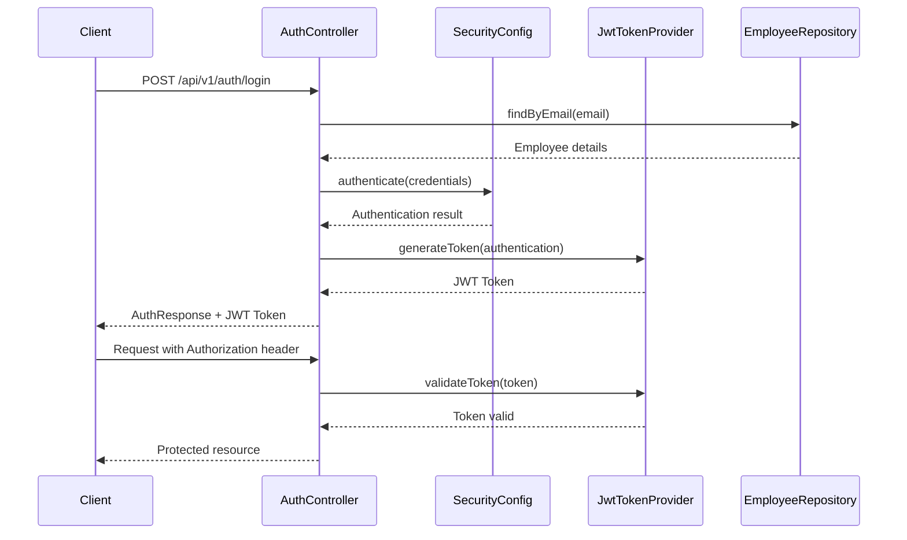

# Authentication System Documentation

## Overview

WheelShiftPro uses a JWT (JSON Web Token) based authentication system with Spring Security, implementing Role-Based Access Control (RBAC) for authorization. This system provides secure user authentication, stateless token management, and granular permission control.

## System Architecture

### Authentication Flow



### Key Components

1. **AuthController** - Handles authentication endpoints
2. **SecurityConfig** - Spring Security configuration with JWT
3. **JwtTokenProvider** - JWT token generation and validation
4. **JwtAuthenticationFilter** - Request interceptor for JWT validation
5. **EmployeeUserDetailsService** - User data access
6. **RBAC System** - Role and permission management

## Authentication Endpoints

### Login
- **URL**: `POST /api/v1/auth/login`
- **Body**: 
  ```json
  {
    "email": "user@example.com",
    "password": "password"
  }
  ```
- **Success Response**:
  ```json
  {
    "employeeId": 1,
    "email": "user@example.com",
    "name": "John Doe",
    "roles": ["ADMIN"],
    "permissions": ["READ_USERS", "WRITE_USERS"],
    "accessToken": "eyJhbGciOiJIUzUxMiJ9...",
    "message": "Login successful",
    "tokenType": "Bearer"
  }
  ```
- **Error Responses**:
  - `404` - User not found
  - `401` - Invalid password

### Get Current User
- **URL**: `GET /api/v1/auth/me`
- **Headers**: 
  ```
  Authorization: Bearer <jwt_token>
  ```
- **Success Response**:
  ```json
  {
    "employeeId": 1,
    "email": "user@example.com",
    "name": "John Doe",
    "roles": ["ADMIN"],
    "permissions": ["READ_USERS", "WRITE_USERS"]
  }
  ```

### Token Validation
- **URL**: `GET /api/v1/auth/validate-session`
- **Headers**: 
  ```
  Authorization: Bearer <jwt_token>
  ```
- **Success Response**:
  ```json
  {
    "valid": true,
    "expired": false,
    "message": "Token is valid",
    "employeeId": 1,
    "email": "user@example.com"
  }
  ```
- **Expired Token Response**:
  ```json
  {
    "valid": false,
    "expired": true,
    "message": "Token expired or invalid",
    "errorCode": "TOKEN_EXPIRED"
  }
  ```

### Logout
- **URL**: `POST /api/v1/auth/logout`
- **Headers**: 
  ```
  Authorization: Bearer <jwt_token>
  ```
- **Success Response**:
  ```json
  {
    "message": "Logout successful. Please discard the JWT token on client side."
  }
  ```

## Token Management

### JWT Configuration

The system uses JWT tokens with the following configuration:

- **Token Expiration**: 24 hours (86400000 ms) - configurable
- **Algorithm**: HS256 (HMAC with SHA-256)
- **Token Format**: Bearer token in Authorization header
- **Claims**:
  - `sub`: Employee ID
  - `email`: Employee email address
  - `iat`: Issued at timestamp
  - `exp`: Expiration timestamp

### Token Lifecycle

1. **Generation**: Token created upon successful login
2. **Validation**: Automatic validation on each protected request via `JwtAuthenticationFilter`
3. **Usage**: Include in Authorization header: `Bearer <token>`
4. **Expiration**: Token expires after 24 hours (configurable)
5. **Renewal**: Client must re-authenticate after expiration
6. **Logout**: Client discards token (no server-side invalidation needed)

## Error Handling

The system provides distinct error responses for different scenarios:

### Token Expired (401 Unauthorized)
```json
{
  "type": "about:blank",
  "title": "Token Expired",
  "status": 401,
  "detail": "Your authentication token has expired. Please login again.",
  "instance": "/api/v1/rbac/permissions",
  "code": "TOKEN_EXPIRED",
  "timestamp": "2026-01-26T10:30:00"
}
```

### Invalid Token (401 Unauthorized)
```json
{
  "type": "about:blank",
  "title": "Unauthorized",
  "status": 401,
  "detail": "Invalid or malformed authentication token.",
  "instance": "/api/v1/rbac/permissions",
  "code": "INVALID_TOKEN",
  "timestamp": "2026-01-26T10:30:00"
}
```

### Insufficient Permissions (403 Forbidden)
```json
{
  "type": "about:blank",
  "title": "Insufficient Permissions",
  "status": 403,
  "detail": "You do not have sufficient permissions to access this resource.",
  "instance": "/api/v1/rbac/permissions",
  "code": "INSUFFICIENT_PERMISSIONS",
  "timestamp": "2026-01-26T10:30:00"
}
```

### Access Denied (403 Forbidden)
```json
{
  "type": "about:blank",
  "title": "Access Denied",
  "status": 403,
  "detail": "You do not have permission to access this resource.",
  "instance": "/api/v1/rbac/permissions",
  "code": "ACCESS_DENIED",
  "timestamp": "2026-01-26T10:30:00"
}
```

## Error Code Reference

| Error Code | HTTP Status | Description | Action Required |
|------------|-------------|-------------|-----------------|
| `TOKEN_EXPIRED` | 401 | JWT token has expired | Re-authenticate |
| `INVALID_TOKEN` | 401 | Malformed or invalid JWT token | Re-authenticate |
| `INSUFFICIENT_PERMISSIONS` | 403 | User lacks required permissions | Contact admin for role assignment |
| `ACCESS_DENIED` | 403 | Generic access denied | Check permissions or re-authenticate |
| `AUTHENTICATION_FAILED` | 401 | Login credentials invalid | Verify credentials |
| `AUTHORIZATION_FAILED` | 401 | General authorization failure | Re-authenticate |

## Frontend Integration

### Handling Authentication Errors

```javascript
// Example axios interceptor for handling auth errors
axios.interceptors.response.use(
  (response) => response,
  (error) => {
    if (error.response?.status === 401) {
      const errorCode = error.response?.data?.code;
      
      if (errorCode === 'TOKEN_EXPIRED' || errorCode === 'INVALID_TOKEN') {
        // Token expired or invalid - redirect to login
        localStorage.removeItem('jwt_token');
        window.location.href = '/login';
      } else {
        // Other auth errors - show error message
        showError('Authentication failed');
      }
    } else if (error.response?.status === 403) {
      const errorCode = error.response?.data?.code;
      
      if (errorCode === 'INSUFFICIENT_PERMISSIONS') {
        showError('You do not have permission to perform this action');
      } else {
        showError('Access denied');
      }
    }
    
    return Promise.reject(error);
  }
);

// Add token to all requests
axios.interceptors.request.use(
  (config) => {
    const token = localStorage.getItem('jwt_token');
    if (token) {
      config.headers.Authorization = `Bearer ${token}`;
    }
    return config;
  },
  (error) => Promise.reject(error)
);
```

### Token Storage and Management

```javascript
// Store token after login
const login = async (email, password) => {
  try {
    const response = await axios.post('/api/v1/auth/login', { email, password });
    const { accessToken, employeeId, roles, permissions } = response.data;
    
    // Store token in localStorage
    localStorage.setItem('jwt_token', accessToken);
    localStorage.setItem('user', JSON.stringify({ employeeId, roles, permissions }));
    
    return response.data;
  } catch (error) {
    console.error('Login failed:', error);
    throw error;
  }
};

// Logout - remove token
const logout = async () => {
  try {
    await axios.post('/api/v1/auth/logout');
  } finally {
    // Always remove token from storage
    localStorage.removeItem('jwt_token');
    localStorage.removeItem('user');
    window.location.href = '/login';
  }
};

// Check if user is authenticated
const isAuthenticated = () => {
  return !!localStorage.getItem('jwt_token');
};
```

### Token Validation

```javascript
// Validate token before making sensitive requests
const validateToken = async () => {
  try {
    const response = await axios.get('/api/v1/auth/validate-session');
    return response.data.valid;
  } catch (error) {
    return false;
  }
};

// Use before critical operations
const performCriticalOperation = async () => {
  const isTokenValid = await validateToken();
  if (!isTokenValid) {
    localStorage.removeItem('jwt_token');
    window.location.href = '/login';
    return;
  }
  
  // Proceed with operation
  await axios.get('/api/v1/rbac/permissions');
};
```

## Security Considerations

### JWT Security

1. **Token Storage**: Store tokens in localStorage or sessionStorage (not in cookies for JWT)
2. **HTTPS Only**: Always use HTTPS in production to prevent token interception
3. **Token Expiration**: Tokens expire after 24 hours by default
4. **Secret Key**: Use a strong secret key (minimum 256 bits) in production
5. **Stateless Authentication**: No server-side session storage required

### Best Practices

1. **Always validate tokens** before performing sensitive operations
2. **Handle token expiry gracefully** in the frontend
3. **Use HTTPS in production** to protect tokens in transit
4. **Implement proper logout** by removing tokens from client storage
5. **Monitor token activity** for security auditing
6. **Rotate JWT secret** periodically in production
7. **Use short expiration times** for sensitive operations

## Testing Authentication

### Manual Testing

```bash
# Login and save token
curl -X POST http://localhost:8080/api/v1/auth/login \
  -H "Content-Type: application/json" \
  -d '{"email": "admin@wheelshiftpro.com", "password": "admin123"}' \
  | jq -r '.accessToken' > token.txt

# Use token for protected endpoint
curl -X GET http://localhost:8080/api/v1/auth/me \
  -H "Authorization: Bearer $(cat token.txt)"

# Validate token
curl -X GET http://localhost:8080/api/v1/auth/validate-session \
  -H "Authorization: Bearer $(cat token.txt)"

# Logout
curl -X POST http://localhost:8080/api/v1/auth/logout \
  -H "Authorization: Bearer $(cat token.txt)"
```

### Unit Test Examples

```java
@Test
public void testTokenExpiry() {
    // Mock expired token
    when(jwtTokenProvider.validateToken(anyString())).thenReturn(false);
    
    ResponseEntity<SessionValidationResponse> response = 
        authController.validateSession(null);
    
    assertThat(response.getBody().isExpired()).isTrue();
    assertThat(response.getBody().getErrorCode()).isEqualTo("TOKEN_EXPIRED");
}

@Test
public void testSuccessfulLogin() {
    LoginRequest request = new LoginRequest("admin@wheelshiftpro.com", "admin123");
    
    ResponseEntity<AuthResponse> response = authController.login(request);
    
    assertThat(response.getStatusCode()).isEqualTo(HttpStatus.OK);
    assertThat(response.getBody().getAccessToken()).isNotNull();
    assertThat(response.getBody().getTokenType()).isEqualTo("Bearer");
}
```

## Configuration Reference

### application.properties

```properties
# JWT Configuration
jwt.secret=your-secret-key-here-minimum-256-bits
jwt.expiration=86400000

# CORS Configuration (if needed)
# Allow credentials for JWT in Authorization header
```

### SecurityConfig.java

```java
.sessionManagement(session -> session
    .sessionCreationPolicy(SessionCreationPolicy.STATELESS)
)
.addFilterBefore(jwtAuthenticationFilter, UsernamePasswordAuthenticationFilter.class)
```

### JWT Token Structure

```json
{
  "sub": "1",
  "email": "admin@wheelshiftpro.com",
  "iat": 1737878400,
  "exp": 1737964800
}
```

## Troubleshooting

### Common Issues

1. **"Token Expired" on every request**
   - Check token expiration configuration
   - Verify system clock synchronization
   - Ensure token is being stored and sent correctly

2. **403 Forbidden for admin user**
   - Verify user has correct roles assigned
   - Check RBAC configuration
   - Validate endpoint security rules
   - Ensure token contains correct claims

3. **Token not being accepted**
   - Check Authorization header format: `Bearer <token>`
   - Verify JWT secret matches between environments
   - Ensure token hasn't expired
   - Check for whitespace in token string

4. **CORS issues with Authorization header**
   - Configure CORS to allow Authorization header
   - Ensure `Access-Control-Allow-Headers` includes `Authorization`

### Debug Logging

Enable debug logging to troubleshoot authentication issues:

```properties
logging.level.com.wheelshiftpro=DEBUG
logging.level.org.springframework.security=DEBUG
logging.level.com.wheelshiftpro.security.JwtAuthenticationFilter=DEBUG
```

## Migration Notes

When upgrading or modifying the authentication system:

1. **Generate strong JWT secret** using secure random generator
2. **Update frontend** to use Authorization header instead of cookies
3. **Test token expiration** behavior thoroughly
4. **Verify RBAC compatibility** with existing roles/permissions
5. **Update API documentation** with new authentication flow
6. **Remove session-related code** and dependencies
7. **Update CORS configuration** to allow Authorization header

### Generating JWT Secret

```bash
# Generate a secure random secret (256 bits)
openssl rand -base64 32

# Or use online tools like: https://www.grc.com/passwords.htm
```

---

*Last updated: January 26, 2026*