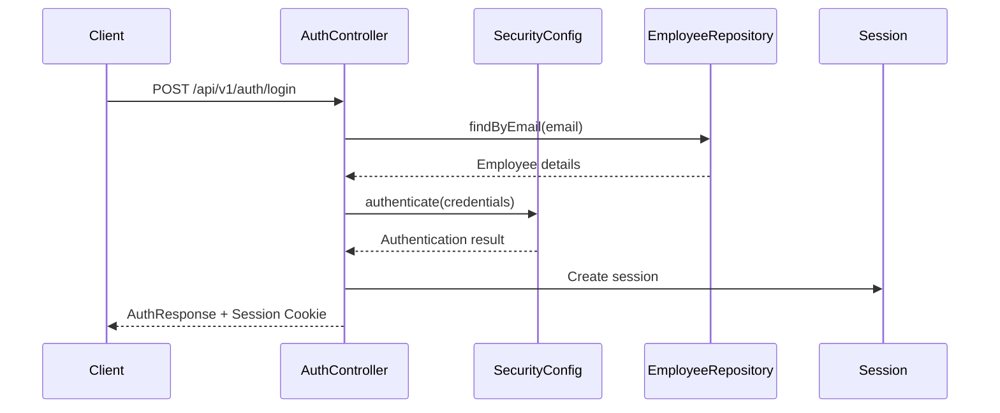

# Authentication System Documentation

## Overview

WheelShiftPro uses a session-based authentication system with Spring Security, implementing Role-Based Access Control (RBAC) for authorization. This system provides secure user authentication, session management, and granular permission control.

## System Architecture

### Authentication Flow



### Key Components

1. **AuthController** - Handles authentication endpoints
2. **SecurityConfig** - Spring Security configuration
3. **EmployeeRepository** - User data access
4. **GlobalExceptionHandler** - Centralized error handling
5. **RBAC System** - Role and permission management

## Authentication Endpoints

### Login
- **URL**: `POST /api/v1/auth/login`
- **Body**: 
  ```json
  {
    "email": "user@example.com",
    "password": "password"
  }
  ```
- **Success Response**:
  ```json
  {
    "employeeId": 1,
    "email": "user@example.com",
    "name": "John Doe",
    "roles": ["ADMIN"],
    "permissions": ["READ_USERS", "WRITE_USERS"],
    "message": "Login successful",
    "tokenType": "Bearer"
  }
  ```
- **Error Responses**:
  - `404` - User not found
  - `401` - Invalid password

### Get Current User
- **URL**: `GET /api/v1/auth/me`
- **Headers**: Session cookie required
- **Success Response**:
  ```json
  {
    "employeeId": 1,
    "email": "user@example.com",
    "name": "John Doe",
    "roles": ["ADMIN"],
    "permissions": ["READ_USERS", "WRITE_USERS"]
  }
  ```

### Session Validation
- **URL**: `GET /api/v1/auth/validate-session`
- **Headers**: Session cookie required
- **Success Response**:
  ```json
  {
    "valid": true,
    "expired": false,
    "message": "Session is valid",
    "employeeId": 1,
    "email": "user@example.com"
  }
  ```
- **Expired Session Response**:
  ```json
  {
    "valid": false,
    "expired": true,
    "message": "Session expired or invalid",
    "errorCode": "SESSION_EXPIRED"
  }
  ```

### Logout
- **URL**: `POST /api/v1/auth/logout`
- **Headers**: Session cookie required
- **Success Response**:
  ```json
  {
    "message": "Logout successful"
  }
  ```

## Session Management

### Session Configuration

The system uses server-side sessions with the following configuration:

- **Session Timeout**: 30 minutes of inactivity
- **Session Cookie Name**: `WHEELSHIFT_SESSIONID`
- **Cookie Attributes**:
  - `HttpOnly`: `true` (prevents XSS attacks)
  - `Secure`: `false` (set to `true` in production with HTTPS)
  - `Max-Age`: 1800 seconds (30 minutes)
- **Session Creation Policy**: `IF_REQUIRED`
- **Maximum Sessions per User**: 1 (concurrent sessions)

### Session Lifecycle

1. **Creation**: Session created upon successful login
2. **Validation**: Automatic validation on each protected request
3. **Extension**: Session timeout extended on each activity
4. **Expiration**: Session expires after 30 minutes of inactivity
5. **Cleanup**: Session invalidated on logout or expiration

## Error Handling

The system provides distinct error responses for different scenarios:

### Session Expired (401 Unauthorized)
```json
{
  "type": "about:blank",
  "title": "Session Expired",
  "status": 401,
  "detail": "Your session has expired. Please login again.",
  "instance": "/api/v1/rbac/permissions",
  "code": "SESSION_EXPIRED",
  "timestamp": "2026-01-16T10:30:00"
}
```

### Insufficient Permissions (403 Forbidden)
```json
{
  "type": "about:blank",
  "title": "Insufficient Permissions",
  "status": 403,
  "detail": "You do not have sufficient permissions to access this resource.",
  "instance": "/api/v1/rbac/permissions",
  "code": "INSUFFICIENT_PERMISSIONS",
  "timestamp": "2026-01-16T10:30:00"
}
```

### Access Denied (403 Forbidden)
```json
{
  "type": "about:blank",
  "title": "Access Denied",
  "status": 403,
  "detail": "You do not have permission to access this resource.",
  "instance": "/api/v1/rbac/permissions",
  "code": "ACCESS_DENIED",
  "timestamp": "2026-01-16T10:30:00"
}
```

## Error Code Reference

| Error Code | HTTP Status | Description | Action Required |
|------------|-------------|-------------|-----------------|
| `SESSION_EXPIRED` | 401 | Session has expired | Re-authenticate |
| `INSUFFICIENT_PERMISSIONS` | 403 | User lacks required permissions | Contact admin for role assignment |
| `ACCESS_DENIED` | 403 | Generic access denied | Check permissions or re-authenticate |
| `AUTHENTICATION_FAILED` | 401 | Login credentials invalid | Verify credentials |
| `AUTHORIZATION_FAILED` | 401 | General authorization failure | Re-authenticate |

## Frontend Integration

### Handling Authentication Errors

```javascript
// Example axios interceptor for handling auth errors
axios.interceptors.response.use(
  (response) => response,
  (error) => {
    if (error.response?.status === 401) {
      const errorCode = error.response?.data?.code;
      
      if (errorCode === 'SESSION_EXPIRED') {
        // Session expired - redirect to login
        window.location.href = '/login';
      } else {
        // Other auth errors - show error message
        showError('Authentication failed');
      }
    } else if (error.response?.status === 403) {
      const errorCode = error.response?.data?.code;
      
      if (errorCode === 'INSUFFICIENT_PERMISSIONS') {
        showError('You do not have permission to perform this action');
      } else {
        showError('Access denied');
      }
    }
    
    return Promise.reject(error);
  }
);
```

### Session Validation

```javascript
// Check session validity before making sensitive requests
const validateSession = async () => {
  try {
    const response = await axios.get('/api/v1/auth/validate-session');
    return response.data.valid;
  } catch (error) {
    return false;
  }
};

// Use before critical operations
const performCriticalOperation = async () => {
  const isSessionValid = await validateSession();
  if (!isSessionValid) {
    window.location.href = '/login';
    return;
  }
  
  // Proceed with operation
  await axios.get('/api/v1/rbac/permissions');
};
```

## Security Considerations

### Session Security

1. **Session Fixation Protection**: Spring Security automatically changes session ID after login
2. **CSRF Protection**: Disabled for API endpoints (ensure proper CORS configuration)
3. **Session Timeout**: Automatic expiration after 30 minutes of inactivity
4. **Concurrent Session Control**: Maximum 1 session per user
5. **Secure Cookies**: Enable in production with HTTPS

### Best Practices

1. **Always validate sessions** before performing sensitive operations
2. **Handle session expiry gracefully** in the frontend
3. **Use HTTPS in production** to protect session cookies
4. **Implement proper logout** to clear sessions
5. **Monitor session activity** for security auditing

## Testing Authentication

### Manual Testing

```bash
# Login
curl -X POST http://localhost:8080/api/v1/auth/login \
  -H "Content-Type: application/json" \
  -d '{"email": "admin@wheelshiftpro.com", "password": "admin123"}' \
  -c cookies.txt

# Use session for protected endpoint
curl -X GET http://localhost:8080/api/v1/auth/me \
  -b cookies.txt

# Validate session
curl -X GET http://localhost:8080/api/v1/auth/validate-session \
  -b cookies.txt

# Logout
curl -X POST http://localhost:8080/api/v1/auth/logout \
  -b cookies.txt
```

### Unit Test Examples

```java
@Test
public void testSessionExpiry() {
    // Mock expired session
    when(session.getAttribute(HttpSessionSecurityContextRepository.SPRING_SECURITY_CONTEXT_KEY))
        .thenReturn(null);
    
    ResponseEntity<SessionValidationResponse> response = 
        authController.validateSession(null, request);
    
    assertThat(response.getBody().isExpired()).isTrue();
    assertThat(response.getBody().getErrorCode()).isEqualTo("SESSION_EXPIRED");
}
```

## Configuration Reference

### application.properties

```properties
# Session Configuration
server.servlet.session.timeout=30m
server.servlet.session.tracking-modes=cookie
server.servlet.session.cookie.name=WHEELSHIFT_SESSIONID
server.servlet.session.cookie.http-only=true
server.servlet.session.cookie.secure=false  # true in production
server.servlet.session.cookie.max-age=1800
```

### SecurityConfig.java

```java
.sessionManagement(session -> session
    .sessionCreationPolicy(SessionCreationPolicy.IF_REQUIRED)
    .maximumSessions(1)
)
```

## Troubleshooting

### Common Issues

1. **"Session Expired" on every request**
   - Check if cookies are being sent
   - Verify session timeout configuration
   - Ensure CORS allows credentials

2. **403 Forbidden for admin user**
   - Verify user has correct roles assigned
   - Check RBAC configuration
   - Validate endpoint security rules

3. **Session not persisting**
   - Check cookie configuration
   - Verify session creation policy
   - Ensure proper CORS setup

### Debug Logging

Enable debug logging to troubleshoot authentication issues:

```properties
logging.level.com.wheelshiftpro=DEBUG
logging.level.org.springframework.security=DEBUG
logging.level.org.springframework.session=DEBUG
```

## Migration Notes

When upgrading or modifying the authentication system:

1. **Backup session data** if using persistent sessions
2. **Update frontend error handling** to use new error codes
3. **Test session timeout** behavior thoroughly
4. **Verify RBAC compatibility** with existing roles/permissions
5. **Update API documentation** with new endpoints and responses

---

*Last updated: January 16, 2026*